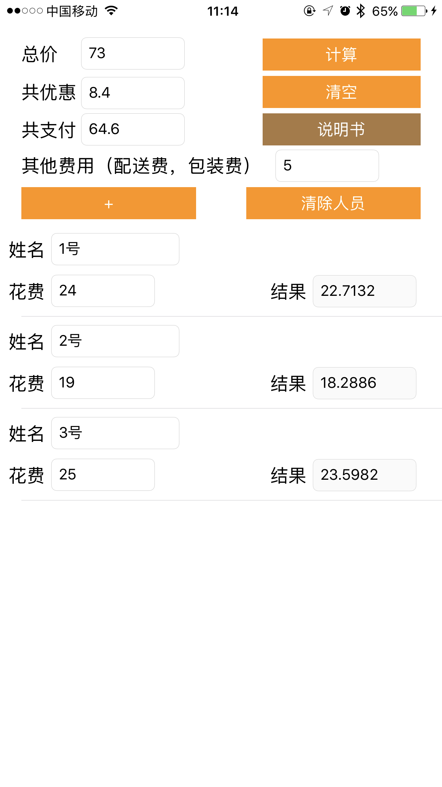

# TakeOutFoodPrice

本App是为了多人一起下单，快速计算出每人应付款。

* 使用方法：

	回收键盘请点击任意空白处
	
	总价：整个订单的价格
	
	共优惠：所有的优惠（满减、红包等）
	
	共支付：最后支付的价格
	
	其他费用：打包费、配送费等
	
	+：添加人员
	
	清除：清楚总价等。
	
	清除人员：清除所有人员（单个删除可以左滑此人）
	
	计算：先验证填写是否正确，然后计算出每人应付款。
	
	计算规则：其他费用进行均摊，然后 
	
	(个人费用 + 其他费用的平均) - ((个人费用 + 其他费用的平均) ➗ 总价格 x 优惠价格) 
	
	得出个人应付价格
	
* 示例

	</img>
	</img>
